# slack-integration-with-jenkins
Quick slack chat notification integration with your Jenkins master to receive pipeline updates.

## Jenkins Plugin

Login into your Jenkins master and then goto Manage Jenkins and then go to Plugins search for "Slack" and then install that plugin 

and allow your Jenkins master to restart.

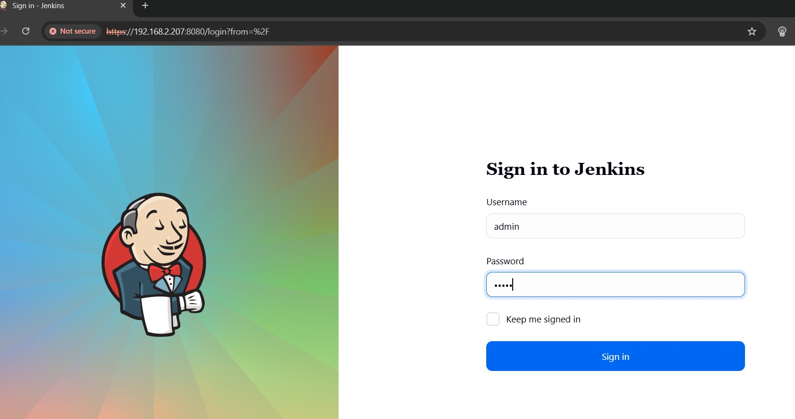

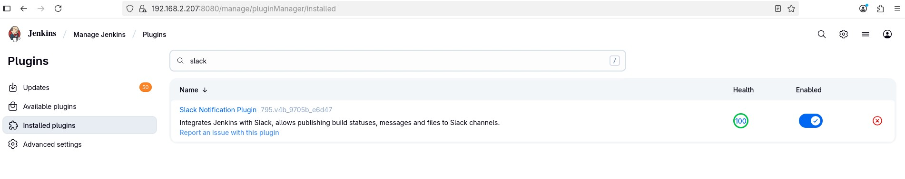

## Configure Slack API

Note: Make sure you already have slack account to login if not make sure it is created.

Login into api.slack and go to your apps and then create an App as follows or follow the recent instructions on this `https://api.slack.com/quickstate`

create an app from scratch

and give a name for the app `Jenkins` and the workspace `Testcorp` 

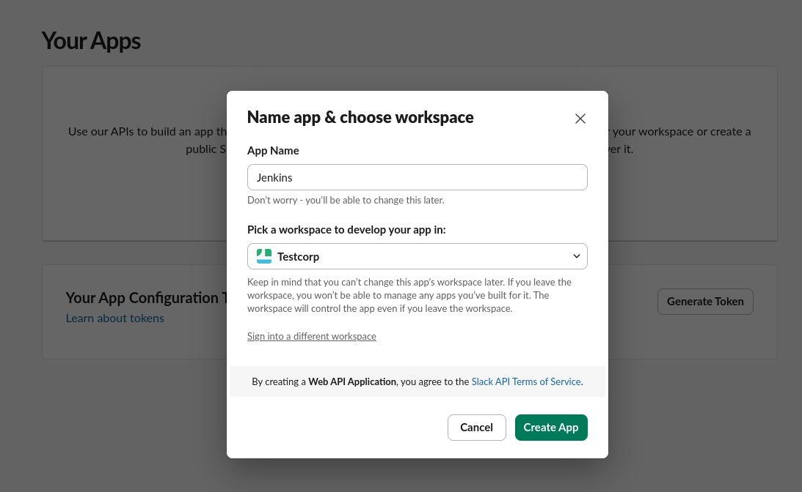

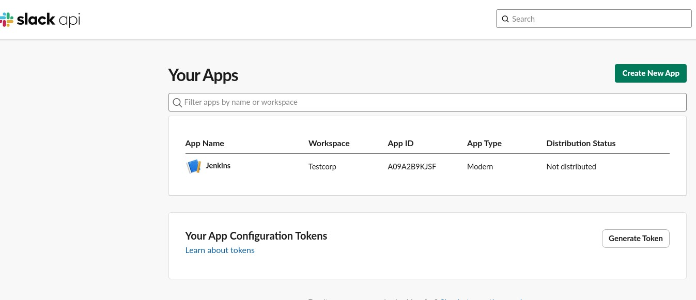

and then go into its settings and focus on following items.

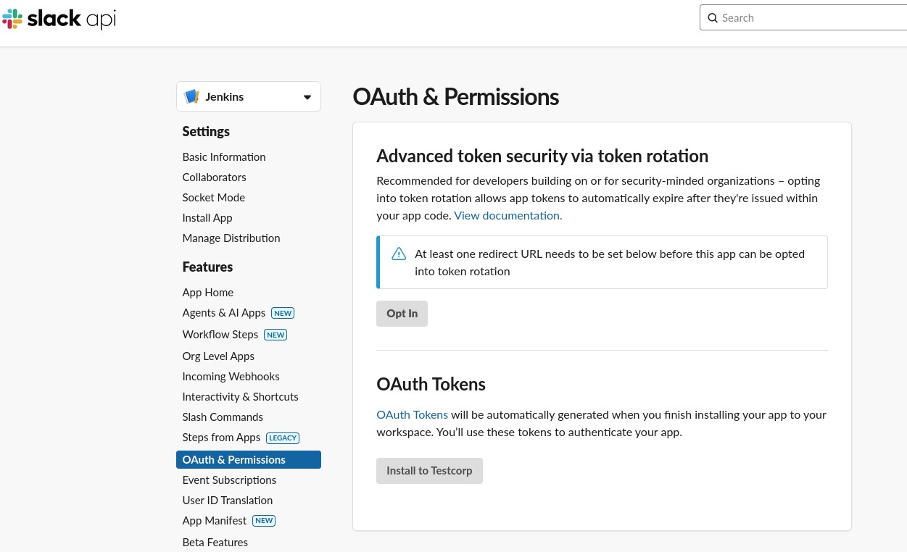

1. Bot Token

Keep the generated bot token safe for using it on the Jenkins slack credential configuration. So, Jenkins can send message with slack using the bot token.

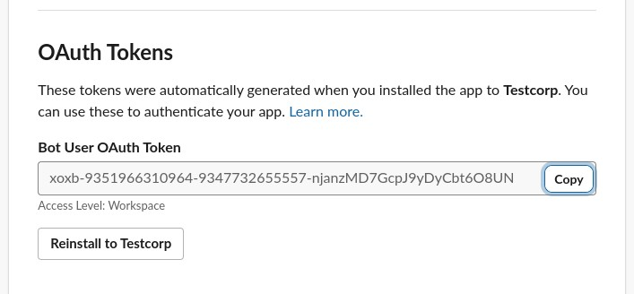

2. Setting Token Scopes

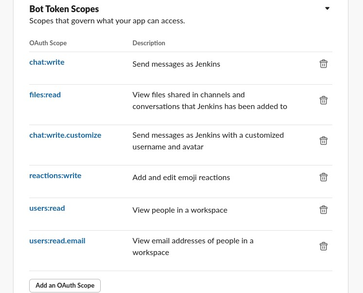

3. OAuth Tokens

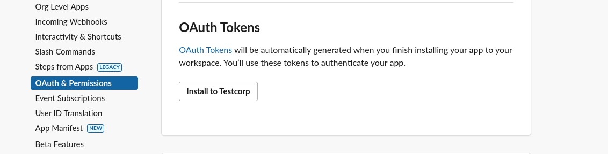

## Slack Application

Add the `Jenkins` apps into the channel and make sure the channel is created and you're part of the channel member.

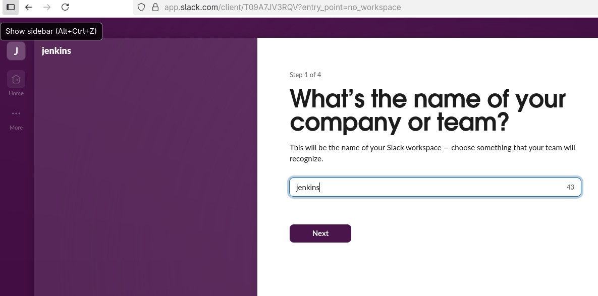

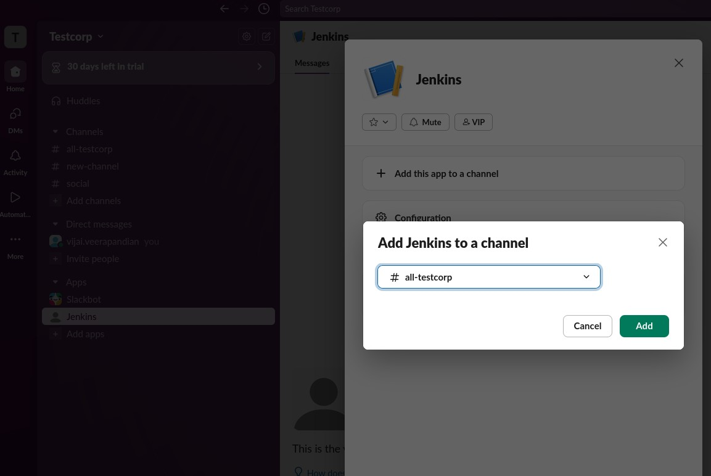

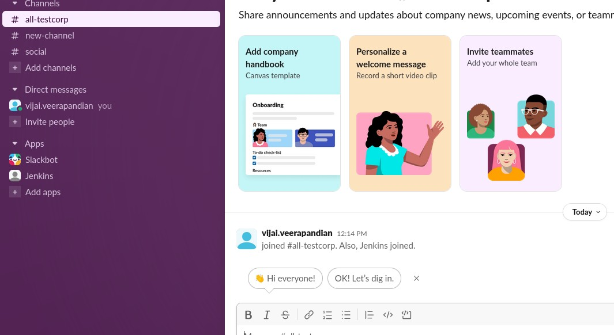

## Jenkins Master Slack Configuration 

Lets go back to Jenkins master server to Manage credentials and to Global credentials and set `secret text` and use the bot token and set slack description and slack ID as : `slack-bot-notification`

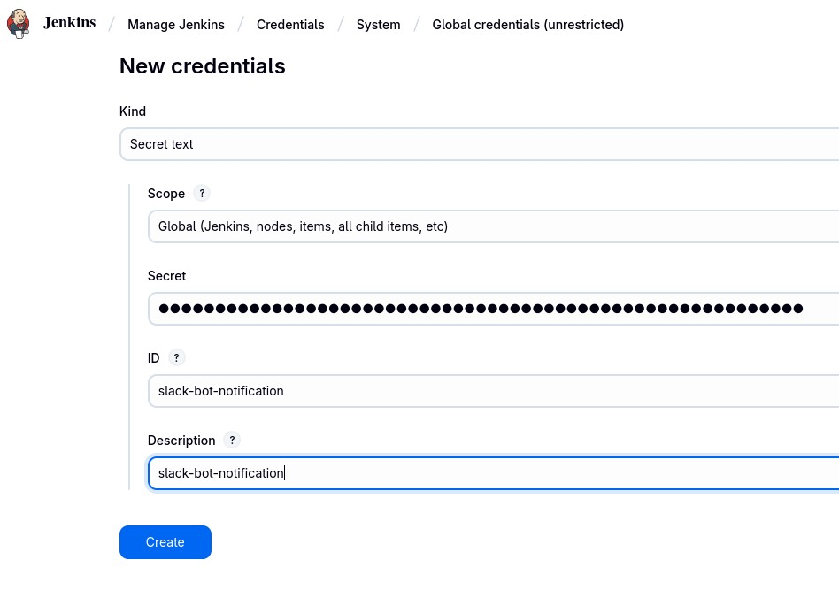

Go back to Manage jenkins and to system and then find `Slack` and then fill the workspace with `Testcorp` which is the project name or the company name and select credentials as `slack-bot-notification` and select the Default channel/member id: `#all-test-corp` which is the channel which is created in the before steps.

and make sure test the connection is happens using `Test Connection` option

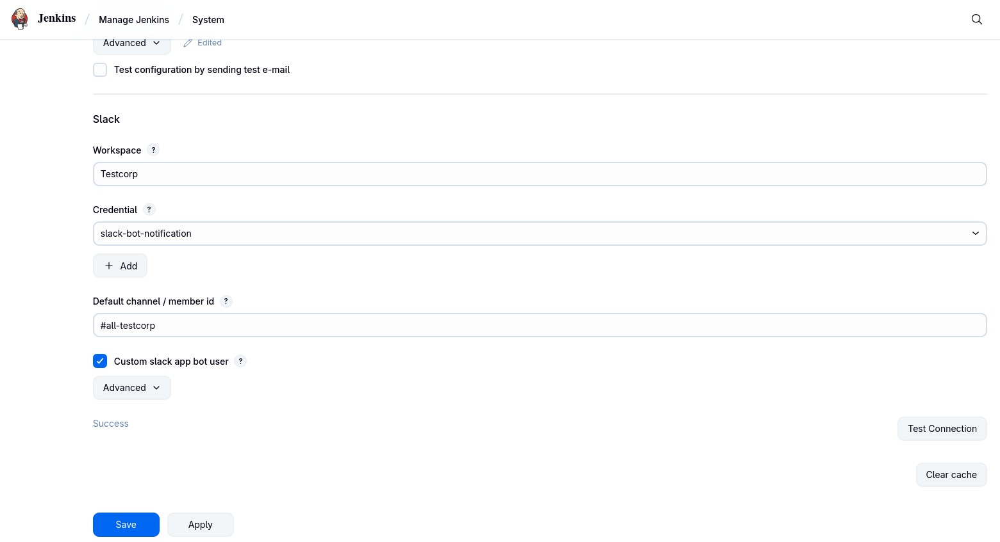

once, the `Test Connection` is successful, You can login into the slack application and should be able to see the Jenkins Master node is showing inside the `all-testcorp` channel. 

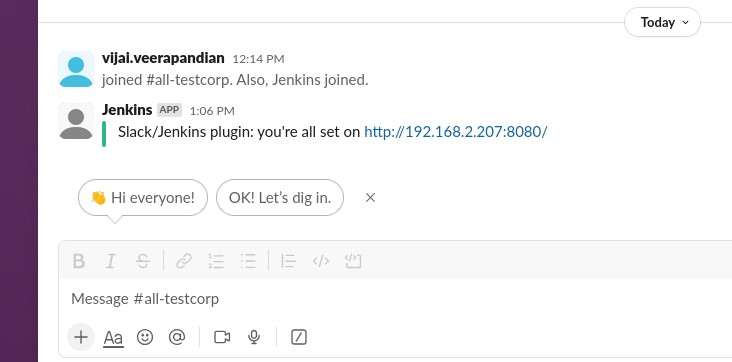

## Jenkins Slack test pipeline

Now, Lets create a sample test pipeline named `quick-slack-pipeline` and select type as pipeline

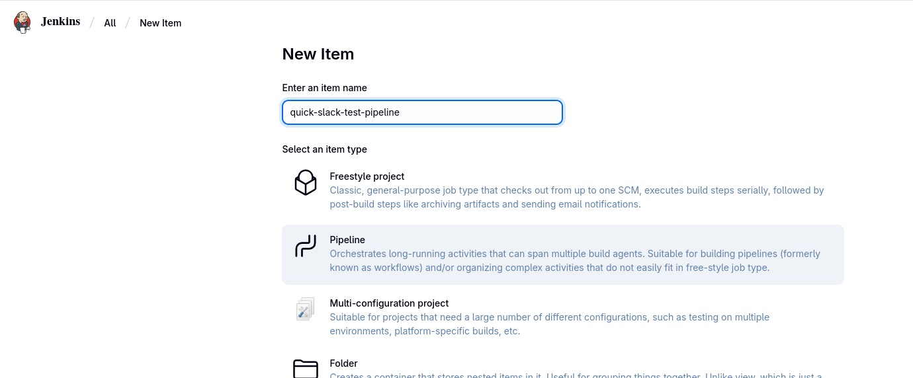

Use the pipeline syntax generator to generate script for `slack` and use that on the `try-sample-pipeline` script

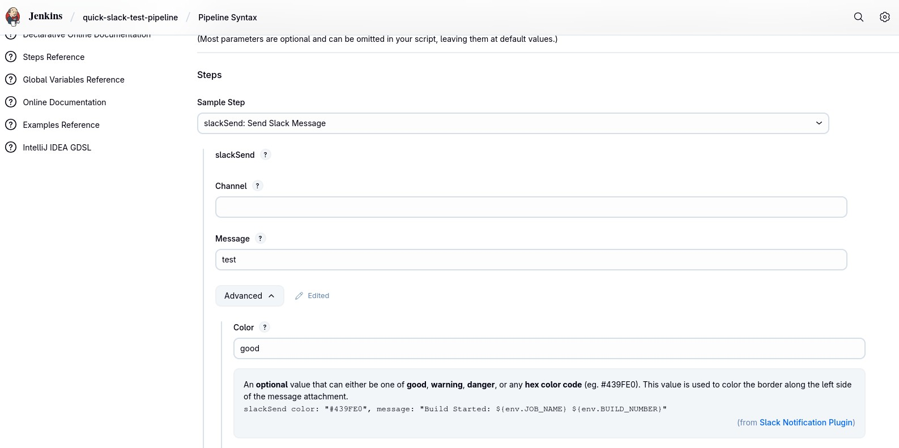

Time to test the pipeline, go ahead click Build Now and let the pipeline operational. 

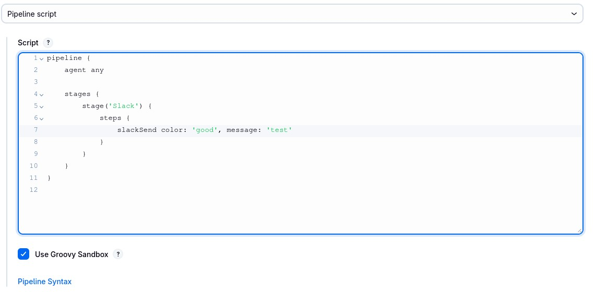

Validate the output through console output.

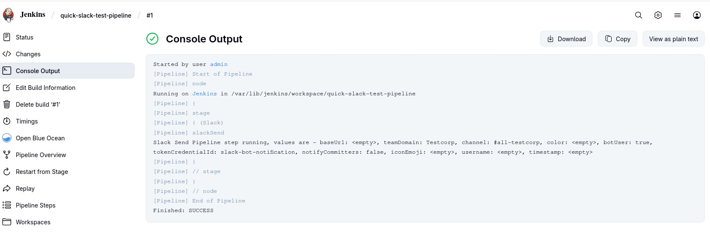

Moment of truth, Check the `all-testcorp` channel inside slack for any message from Jenkins.

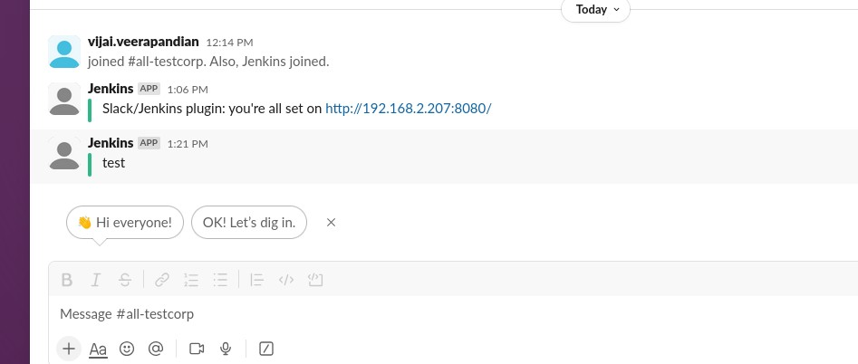

Validate, It works. Time to go ahead and build pipeline your project and make sure  `slackSlack message` is added at each step of Jenkins pipeline process to get notified on the slack. 

